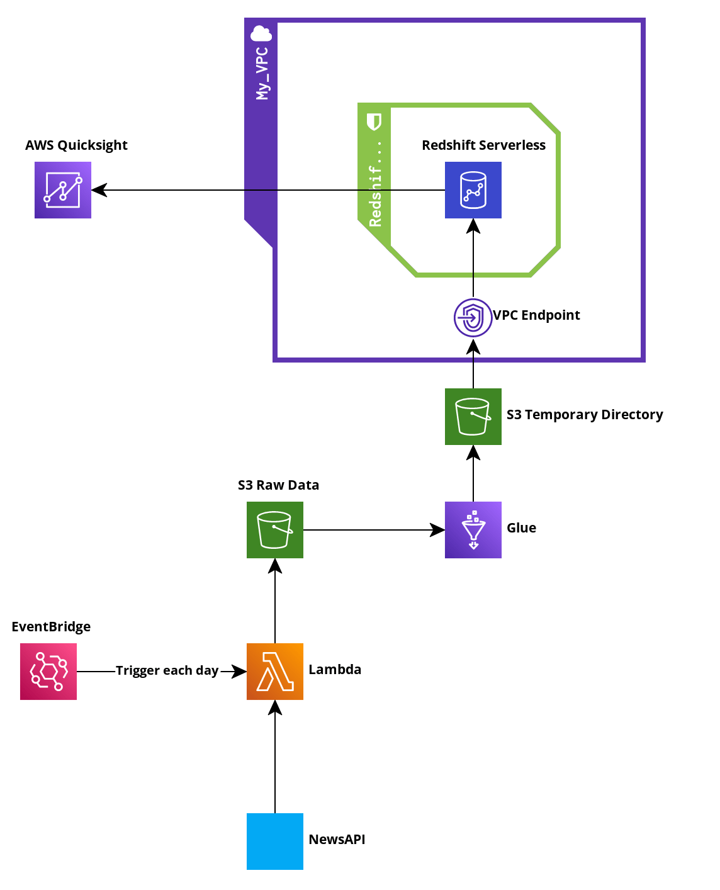

# News-aggregation-system-on-AWS
Since there has been an overabundance of information lately and everyone is short of time, I wanted to create a tool that would pick out the most important news of recent weeks and present it in an accessible form to the user. This will save him a lot of time, because he will have in one place the most important from the world of information. 

Tools and services used:
- NewsAPI - https://newsapi.org/
- Lambda - to collect daily raw data using api
- EventBridge - to trigger lambda daily
- S3 - to store raw data and temporary files during the process
- AWS Glue - for ETL process, taking raw data from S3, cleaning / transforming it and uploading to Redshift in structured way
- PySpark - to take advantage of the full potential of glue
- AWS Redshift - store structured data and allow BI tools to access it
- AWS Quicksight - to visualize the results
- VPC - to secure and monitor connections, screen traffic, and restrict instance access inside my virtual network
- IAM - to specify what can access services and resources in AWS

I realize that the tools I used are more suitable for big data. At the scale of the data used, I could use RDS instead of Redshift and Lambda instead of Glue, and I would not lose performance. In fact, I would save some money. I chose these tools in order to become more familiar with them. In addition, it allows better scaling in the current configuration. 

Steps:
1. Wrote Lambda function to collect raw data from the NewsAPI. The raw data is transformed from json format and saved as csv on S3 bucket. The function uses boto3, pandas and NewsApiClient libraries. We have to zip those libraries and import them as Layers.
2. Set EventBridge event to trigger the lambda function everyday at 12.00 BST time.
3. Configured Redshift workgroup and namespace for 'news' table.
4. Configured VPC and security groups for Glue, S3 and Redshift.
5. Set Glue Job using PySpark and Glue Spark Shell for data extraction, cleaning and transformation.
6. Add VPC endpoint to the VPC configuration to save Glue Dynamic Frame temporarly on S3 and then to Redshift table.
7. Configured security groups once again to allow Quicksight the access to Redshift.
8. Visualize the data.

